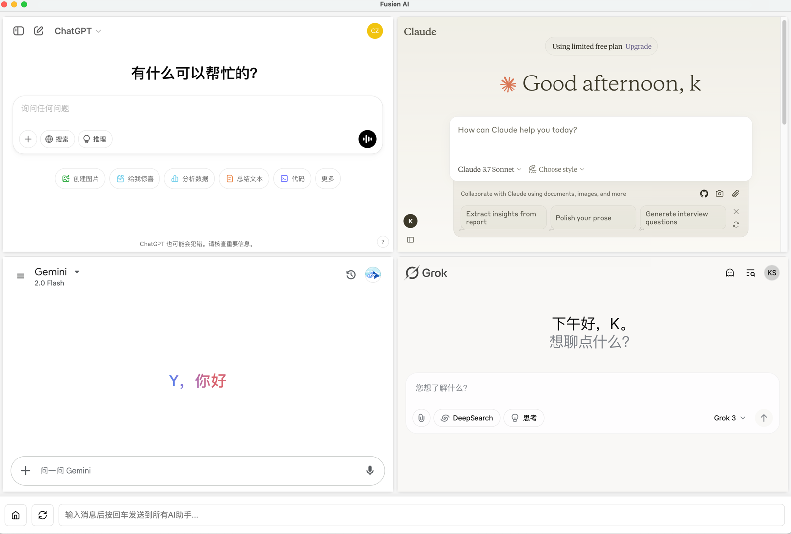

# Fusion AI

一个集成多个 AI 聊天界面的桌面应用程序。

[](https://github.com/Killua67/Fusion_Ai/actions/workflows/build.yml)

## 项目简介

Fusion AI 是一个基于 Electron 开发的跨平台桌面应用，旨在为用户提供一个统一的 AI 聊天平台，让用户可以在同一个界面中使用多个 AI 服务。

## 功能特点

- 多 AI 平台集成
- 统一的聊天界面
- 跨平台支持（macOS、Windows、Linux）
- 简洁现代的用户界面

## 下载安装

你可以直接从 [GitHub Releases](https://github.com/Killua67/Fusion_Ai/releases) 页面下载最新版本的安装包。

### 各平台安装包说明

#### macOS 安装包
- **文件格式**: `.dmg` 和 `.zip`
- **支持架构**: 
  - Universal (同时支持 Intel x64 和 Apple Silicon arm64)
- **安装方法**:
  - `.dmg`: 双击打开，将应用拖到 Applications 文件夹
  - `.zip`: 解压后得到应用程序

#### Windows 安装包
- **文件格式**:
  - `Fusion.AI.Setup.1.0.0.exe` - 安装版
  - `Fusion.AI.1.0.0.exe` - 便携版
- **支持架构**:
  - x64 (64位 Intel/AMD 处理器)
  - arm64 (ARM 架构处理器，如 Surface Pro X)
- **安装方法**:
  - 安装版: 双击运行安装程序，按照向导完成安装
  - 便携版: 双击直接运行，无需安装

#### Linux 安装包
- **文件格式**:
  - `.AppImage` - 通用 Linux 应用格式
  - `.deb` - Debian/Ubuntu 系列发行版安装包
  - `.rpm` - Red Hat/Fedora/CentOS 系列发行版安装包
- **支持架构**:
  - x64 (64位)
- **安装方法**:
  - `.AppImage`: 添加执行权限后直接运行 (`chmod +x *.AppImage`)
  - `.deb`: 使用 `sudo dpkg -i *.deb` 或双击安装
  - `.rpm`: 使用 `sudo rpm -i *.rpm` 或双击安装

### 选择合适的安装包

- **普通用户**:
  - macOS: 使用 `.dmg` 安装包
  - Windows: 使用安装版 (`Fusion.AI.Setup.1.0.0.exe`)
  - Linux: 根据发行版选择 `.deb`、`.rpm` 或通用的 `.AppImage`

- **特殊需求用户**:
  - 无管理员权限: 使用便携版 (Windows) 或 AppImage (Linux)
  - 需要便携式使用: Windows 便携版或 macOS 的 `.zip` 版本
  - ARM 设备: 选择对应的 arm64 版本

## 安装说明（开发者）

### 环境要求

- Node.js >= 14.0.0
- Yarn 包管理器

### 安装 Yarn

1. 使用 npm 安装 Yarn（需要先安装 Node.js）：
```bash
npm install -g yarn
```

2. 验证安装：
```bash
yarn --version
```

如果你使用其他操作系统，也可以参考 [Yarn 官方安装指南](https://classic.yarnpkg.com/en/docs/install)。

### 安装步骤

1. 克隆项目
```bash
git clone ..../Fusion_Ai.git
cd Fusion_Ai
```

2. 安装依赖
```bash
yarn install
```

3. 启动开发环境
```bash
yarn start
```

4. 打包应用
```bash
yarn build
```

## 使用说明

1. 启动应用后，您可以在主界面看到所有支持的 AI 平台
2. 选择想要使用的 AI 服务
3. 开始聊天交互

## 开发相关

- 使用 Electron 框架开发
- 采用现代化的 UI 设计
- 支持自定义主题

### 构建说明

项目使用 GitHub Actions 自动构建所有平台的安装包。每当推送新的版本标签（tag）时，会自动触发构建流程：

1. 本地创建新版本：
```bash
# 更新 package.json 中的版本号后
git add .
git commit -m "bump version to x.x.x"
git tag vx.x.x
git push && git push --tags
```

2. 手动构建特定平台版本：
```bash
# macOS
yarn build:mac

# Windows
yarn build:win

# Linux
yarn build:linux

# 构建所有平台（需要在对应平台上执行）
yarn build
```

构建产物将保存在 `dist` 目录下。

### 自动发布流程

项目配置了 GitHub Actions 工作流，可以自动构建和发布新版本：

1. 当推送带有 `v` 前缀的标签（如 `v1.0.0`）时，会自动触发构建流程
2. 工作流会在 macOS、Windows 和 Linux 三个平台上构建应用
3. 构建完成后，会自动创建一个新的 GitHub Release
4. 所有平台的安装包会被上传到该 Release

您也可以通过 GitHub 界面手动触发工作流：
1. 进入项目的 Actions 标签页
2. 选择 "Build and Release" 工作流
3. 点击 "Run workflow" 按钮
4. 选择分支并确认

## 软件界面展示



软件支持多种 AI 模型:
- ChatGPT
- Claude
- Gemini
- Grok 

## 贡献指南

欢迎提交 Issue 和 Pull Request 来帮助改进这个项目。

## 许可证

MIT License 
